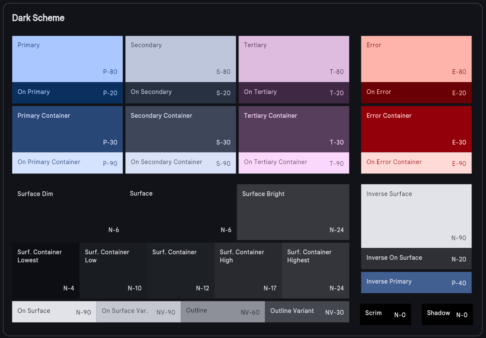
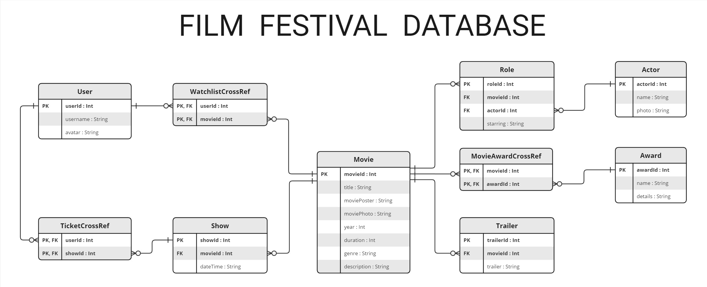

# Science-Fiction Film Festival app

## Table of contents
* [UI design](#ui-design)
* [Database](#database)
* [Implementation](#implementation)
* [System configuration](#system-configuration)

## UI design
Application UI was design in the following Figma project:  
`https://www.figma.com/design/0I1a6Scu0Gnp7X4TbdyKKW/Mockupy?node-id=122-538`

Color scheme was generated using Material Theme Builder (https://material-foundation.github.io/material-theme-builder/)  
The following colors are used in the app:  

  

## Database
To store all the required data Room database was used.  
The following image presents a database diagram:  

  

## Implementation
App is written in the MVVM architectural pattern.  
Main folders of the application are:
- `api` - integrates the app with an external api providing latest film festival news.
- `composables` - stores reusable composable parts that are logically extracted from the code (e.g. `BottomNavBar` which is used on many screens).
- `data` - keeps Room database DAOs and Repositories (which provide convenient data access) together.
- `di` - modules required for dependency injection (Hilt).
- `models` - entities of the Room database mentioned on the database diagram.
- `screens` - stores files responsible for each screen's layout.
- `ui/theme` - files related to the themes, colors etc.
- `utils` - extracted files that will be used by many others, they contain some useful utilities.

## System configuration
### Configure Android Studio emulator next to the Windows Hyper-V
If you want to run the emulator, you should (or have to?) disable the Hyper-V using command:  
`bcdedit /set hypervisorlaunchtype off`  
In case you want to enable back the Hyper-V:  
`bcdedit /set hypervisorlaunchtype auto`    
> [!IMPORTANT]
> Restart to take effect and apply changes.

### Check whether a hypervisor is installed
1. Navigate to:  
	`cd AppData\Local\Android`  
2. Type:  
	`Sdk\emulator\emulator -accel-check`  
3. If the hypervisor is installed expect the result:  
	> accel:  
	> 0  
	> AEHD (version 2.0) is installed and usable.  
	> accel  

### Check whether emulator driver is operating
1. Navigate to:  
	`cd AppData\Local\Android\Sdk\emulator`  
2. If your version of AEHD (from the previous step) is 2.1 or higher type:  
	`sc query aehd`  
   Else type:  
	`sc query gvm`
3. Expect the result:  
	> SERVICE_NAME: gvm  
	> ...  
	> STATE			: 4  RUNNING  
	> ...